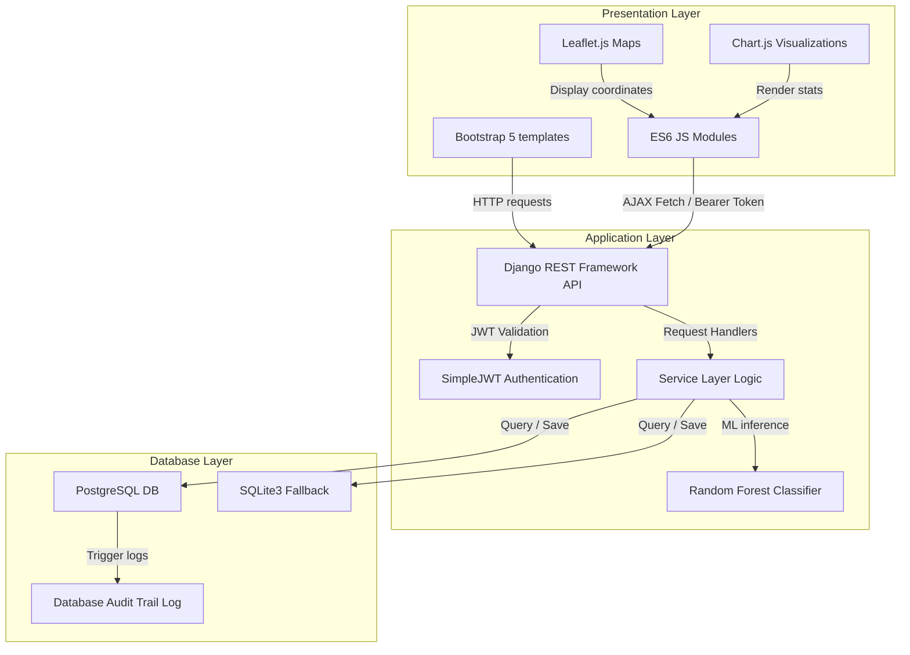

# Crime Analysis & Prediction System (CAPS) 🚓🔮

An enterprise-grade, machine-learning-powered web application designed for real-time crime incident reporting, geospatial visualization, statistical analysis, and predictive risk assessment.

---

## 🏗️ System Architecture

CAPS is engineered following a clean, decoupled **Three-Tier Architecture** ensuring high separation of concerns:



### Key Tiers:
1. **Presentation Tier:** Server-rendered HTML templates utilizing **Bootstrap 5** and modular **Vanilla JS ES6** elements to invoke REST API endpoints asynchronously. Map rendering is powered by **Leaflet.js** and charts by **Chart.js**.
2. **Application Tier:** Core Django backend leveraging **Django REST Framework (DRF)**. All business logic is encapsulated in isolated `services.py` modules to maintain single responsibility. Predictor inferences utilize a cached **Scikit-learn Random Forest Classifier**.
3. **Database Tier:** Production-ready **PostgreSQL** storage (with dynamic **SQLite3** configuration for automated testing and development).

---

## 📁 Repository Folder Structure

```
crime-analysis-system/
├── .github/                 # Automated CI/CD pipelines
│   └── workflows/
│       └── ci.yml           # GitHub Actions workflow running test suites
│
├── backend/                 # Backend Services & APIs
│   ├── config/              # Django settings, WSGI, ASGI, and urls configurations
│   └── apps/                # Django application modules
│       ├── authentication/  # JWT-based authentication & profiles management
│       ├── crime_data/      # Crime incidents, locations, categories, and audit schema
│       ├── analytics/       # Aggregation endpoints for Chart.js rendering
│       └── prediction/      # Machine Learning training & risk inference pipelines
│
├── database/                # Database Scripts & Schema definition
│   └── schema/
│       └── init_db.sql      # Raw SQL schema definition for PostgreSQL
│
├── docker/                  # Containment Configurations
│   ├── backend/
│   │   └── Dockerfile       # Python container recipe
│   └── db/
│       └── init.sql         # Database initialization hook
│
├── frontend/                # Frontend Presentation Layer
│   ├── templates/           # Server-rendered HTML Layouts (base, dashboard, prediction...)
│   └── static/              # Static Assets
│       ├── css/             # Custom custom styling (style.css)
│       └── js/              # Client-side javascript controllers (api, auth, dashboard...)
│
├── tests/                   # Verification Suite
│   ├── conftest.py          # Pytest setup and test database bindings
│   └── test_integration.py  # Automated integration test specifications
│
├── requirements/            # Application Dependencies
│   └── requirements.txt     # Python library list
│
├── requirements.txt         # Root-level requirements shortcut
├── render.yaml              # Render Infrastructure-as-Code deployment file
├── docker-compose.yml       # Docker orchestrator configuration
├── .env.example             # Template for local secret environment variables
└── README.md                # Project documentation
```

---

## 🚀 Key Features

* 🔐 **Secure Auth (JWT):** Token-based clearance access control mapped to user roles (`Officer`, `Analyst`, `Admin`, `Public`).
* 🗺️ **Geospatial Mapping:** Interactive hotspots map using **Leaflet.js** with customized glowing pins color-coded by incident severity level.
* 🔮 **ML Inferences:** Scikit-learn Random Forest model predicting likely crime category and calculating a normalized **Explainable Risk Score (1.0 to 10.0)** based on coordinates density and hourly modifiers.
* 📈 **Visual Analytics:** Complete stats page utilizing **Chart.js** displaying hourly distributions, daily frequencies, area levels, and incident categories.
* ✍️ **Inline Status Toggling:** Authorization-guarded dropdown options for Analysts/Admins to update incident status inline, updating database tables instantly.
* 📜 **Database Audit Log:** Automatic tracking of all database modifications (`CREATE`, `UPDATE`, `DELETE`) showing the trigger user and timestamp logs.

---

## 🖥️ Screen Visualizations & Mockups

The CAPS web application is designed with custom dark-mode aesthetics using glassmorphic UI cards, subtle radial background gradients, and Outfit/Inter typography.

### 1. Incident Control Dashboard
* Centered around a **Real-time Geospatial Hotspots Map** loading Leaflet dark-theme maps. Hovering or clicking severity pins reveals incident description, category, and date parameters.
* Real-time metrics grid animating counts for total reports, resolution rate, active jurisdictions, and pending statuses.

### 2. ML Prediction Desk
* Side-by-side split screen showing a parameter input form (location selector and hour of day slider) on the left, and inference results on the right.
* Visualizes risk radius overlay circles on the map and includes a **Model Feature Importance Chart** (horizontal Chart.js bar graph) illustrating feature weights.

### 3. Incident Management Portal
* Centralized grid displaying all reports. Analysts and Admins see interactive status selection menus to update logs instantly.

### 4. Audit Log Panel
* Tabular panel for security monitoring, tracking timestamps, actor names, target row IDs, and audit details.

---

## 🛠️ Installation & Setup

### Running via Docker (Recommended)
1. **Copy example environment file:**
   ```bash
   cp .env.example .env
   ```
2. **Build and spin up the containers:**
   ```bash
   docker-compose up --build -d
   ```
3. The server will run at `http://localhost:8000`.

### Running Locally (Without Docker)
1. **Create and Activate Virtual Environment:**
   ```bash
   python -m venv .venv
   # Windows:
   .venv\Scripts\activate
   # Linux/macOS:
   source .venv/bin/activate
   ```
2. **Install Dependencies:**
   ```bash
   pip install -r requirements.txt
   ```
3. **Configure Environment Variables:** Rename `.env.example` to `.env` and fill out database detail properties.
4. **Run DB Migrations:**
   ```bash
   python backend/manage.py migrate
   ```
5. **Seed Database (Optional mock data):**
   ```bash
   python scratch/seed_db.py
   ```
6. **Start Django Server:**
   ```bash
   python backend/manage.py runserver
   ```
   Access the app at `http://127.0.0.1:8000`.

---

## 🧪 Testing Suite

Automated integration tests verify user registration, JWT logins, report creation, and ML predictions.

Run all tests via pytest:
```bash
pytest tests/
```

---

## 👥 Open Source Maintainer & Contributor
* **Lead Engineer:** Antigravity (Advanced Agentic Coding Team, Google DeepMind)
